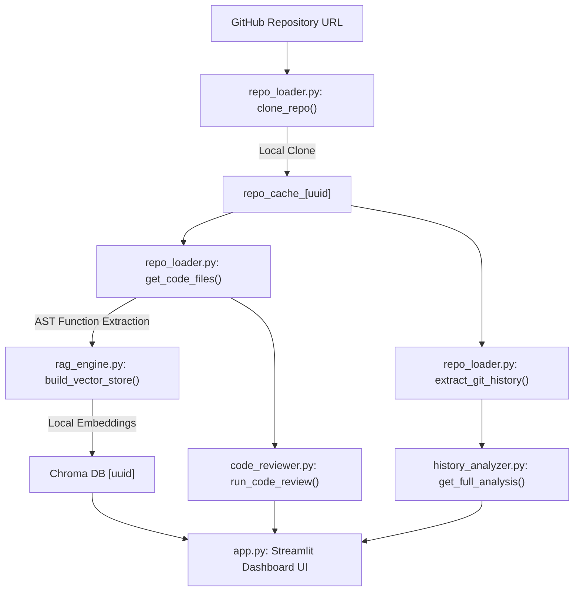

# 🎓 Developer & Interview Guide: Git Analyzer

This guide provides a comprehensive, function-by-function and design-pattern breakdown of the **Git Analyzer** project. Use this to prepare for your interview, understand the architecture, and confidently explain the engineering decisions.

---

## 🗺️ Architectural Flow

Here is the data flow of the application from user input to the final dashboard:



---

## 📁 File-by-File Technical Breakdown

### 1. `app.py` (The Entry Point & Orchestrator)
This file sets up the **Streamlit** user interface, manages user inputs, holds session state variables, and orchestrates the call sequence.

*   **Imports**: Standard libraries (`os`, `uuid`, `pandas`, `plotly`) and our custom analytical modules.
*   **Streamlit Session State (`st.session_state`)**:
    *   Streamlit runs the script from top to bottom on every user interaction. We use `st.session_state` to store variables (like the cloned `repo`, `chat_history`, RAG `chain`, and `reviews`) to prevent them from resetting on every click.
*   **UUID Session Generation (Lines 25–26)**:
    ```python
    if "session_id" not in st.session_state:
        st.session_state.session_id = str(uuid.uuid4())
    ```
    *   *Interview Talking Point*: Generated a unique UUID per user session. This is appended to local folders (`./repo_cache_uuid`, `./chroma_db_uuid`) so that multiple users visiting the app concurrently do not overwrite each other's data (fully thread-safe/session-isolated).
*   **Sidebar & Setup Button (Lines 51–90)**:
    When the user clicks "Analyze Repository":
    1.  **Releases locks**: Explicitly calls `.close()` on the previous Git `Repo` object and the previous Chroma DB `_client` to prevent file descriptor locking errors (`WinError 32`) on Windows during cleanup.
    2.  **Cloning**: Clones the repo to the session-isolated directory.
    3.  **RAG Building**: Runs AST chunking, builds the vector database, and generates the LangChain chain.
    4.  **Analytics**: Processes git logs and contributor stats.
    5.  **Code Review**: Runs parallel/sequential LLM reviews on functions.
*   **Dashboard Layout Tabs (Lines 87–275)**:
    Splits the main display into three interactive tabs:
    *   *Tab 1 (RAG Chat)*: Handles message inputs and chat history display.
    *   *Tab 2 (History)*: Leverages Plotly to render interactive charts for commit timelines, contribution metrics, and warning panels for merge conflicts or high-collision files.
    *   *Tab 3 (Review)*: Groups reviewed functions in streamlit expanders with color-coded severity metrics (🟢 low, 🟡 medium, 🔴 high).

---

### 2. `modules/repo_loader.py` (Cloning & Parsing)
Responsible for fetching code from GitHub and loading files and commits into python dictionaries.

*   `clone_repo(github_url, dest)`:
    *   Checks if the target folder exists. If it does, deletes it robustly on Windows:
        ```python
        def remove_readonly(func, path, excinfo):
            os.chmod(path, stat.S_IWRITE)
            func(path)
        shutil.rmtree(dest, onerror=remove_readonly)
        ```
        *   *Interview Talking Point*: Windows makes git object packs read-only by default. Standard `shutil.rmtree` throws a `PermissionError`. Passing an `onerror` handler that changes the permission of the locked file (`stat.S_IWRITE`) and retries the deletion resolves this.
    *   Clones the repository locally using `Repo.clone_from`.
*   `get_code_files(repo_path)`:
    *   Walks the directory structure while ignoring standard directories (`.git`, `node_modules`, `venv`, `__pycache__`).
    *   Filters files by supported extensions (`.py`, `.js`, `.ts`, `.java`, etc.).
    *   Reads and returns a list of dictionaries containing file contents and relative paths.
*   `extract_git_history(repo)`:
    *   Iterates commits using GitPython's `repo.iter_commits()`.
    *   Extracts author name, date, commit message, files changed, lines inserted, and lines deleted.

---

### 3. `modules/history_analyzer.py` (Commit & Contributor Analytics)
Uses Pandas to structure commit stats and identify developer collaboration patterns.

*   `classify_commit(message)`:
    *   Uses keyword-matching (`fix`, `feat`, `refactor`, `chore`, `docs`) to automatically group commits into categories.
*   `detect_conflict_commits(commits)`:
    *   Scans commit messages for merge conflict resolutions (`merge conflict`, `resolve conflict`, etc.).
*   `get_file_collision_risk(commits, repo)`:
    *   Maps each file to the developers who touched it.
    *   Calculates a "Risk Score": If a file is edited by 4+ developers, it is flagged as **High Collision Risk** (high chance of conflicts); if by 2–3 developers, it is **Medium Risk**.
*   `analyze_contributors(commits)`:
    *   Aggregates commits, lines added, and lines deleted per author into a Pandas DataFrame, sorted in descending order of contribution.
*   `analyze_commit_timeline(commits)`:
    *   Resamples commits by date to prepare values for Plotly timeline charts.

---

### 4. `modules/rag_engine.py` (The RAG Engine)
Extracts structure from code files, indexes them into a local vector database, and runs conversational search.

*   `extract_functions_from_file(file_info)`:
    *   *Interview Talking Point (AST Chunking)*: Instead of splitting source code by arbitrary character lengths (which splits functions in half), we use Python's **Abstract Syntax Tree (AST)** parser. It scans Python code, detects function boundaries (`ast.FunctionDef`, `ast.AsyncFunctionDef`), extracts the clean source segment, and bundles it as a LangChain `Document` with metadata (line number, function name). Non-python files fall back to standard text chunking.
*   `build_vector_store(code_files, chroma_dir)`:
    *   Deletes any existing database at `chroma_dir` to ensure fresh index loads.
    *   Splits long function segments using `RecursiveCharacterTextSplitter`.
    *   Loads local HuggingFace embeddings:
        ```python
        embeddings = HuggingFaceEmbeddings(
            model_name="sentence-transformers/all-MiniLM-L6-v2"
        )
        ```
        *   *Interview Talking Point*: Rather than using external cloud embeddings (which require API tokens and are prone to network latency/failures), we run `HuggingFaceEmbeddings` locally. The model `all-MiniLM-L6-v2` runs locally on the host CPU, is lightweight (~90MB), and computes embeddings rapidly.
    *   Saves the embeddings into **Chroma DB** (persistent directory-based vector database).
*   `get_rag_chain(vectorstore)`:
    *   Initializes **ChatGroq** (using LLaMA-3.3-70B via Groq API).
    *   Converts Chroma into a retriever (queries top 5 relevant document chunks).
    *   Sets up the chain using **LCEL (LangChain Expression Language)**:
        ```python
        chain = (
            {"context": retriever | format_docs, "question": RunnablePassthrough()}
            | prompt
            | llm
            | StrOutputParser()
        )
        ```
        *   *Interview Talking Point*: LCEL uses pipe operator `|` composition to stream the user query, retrieve context, format it into a prompt template, call the Groq model, and parse the output text in a single, high-performance declaration.

---

### 5. `modules/code_reviewer.py` (Structured LLM Code Review)
Reviews functions and extracts clean JSON reviews.

*   `extract_functions_for_review(code_files)`:
    *   Finds all functions in python files that are longer than 50 characters to skip simple utility lines.
*   `review_function(llm, func)`:
    *   Prompts the model to act as a Senior Software Engineer.
    *   Enforces JSON output structure containing bugs list, security checks, refactoring hints, severity, and overall score out of 10.
    *   Cleans markdown wrapper code blocks (e.g. ` ```json `) and parses the string using `json.loads`.
    *   Gracefully falls back to an error summary dict if the JSON parsing fails.
*   `run_code_review(code_files, max_functions)`:
    *   Extracts functions, limits them to avoid Groq rate limits (default: up to 15–20 functions), and reviews them in sequence.

---

## 💡 Top 5 High-Impact Interview QA

### Q1: Why did you use AST (Abstract Syntax Tree) parsing for chunking rather than standard character splitting?
> **Answer**: Standard text splitters split documents by paragraph or character boundaries. For code, this is dangerous because class contexts, function headers, or docstrings get sliced in half, losing semantic meaning. Using AST, we parse the code into logical syntactic nodes and extract individual functions whole. This guarantees that the vector database stores complete, runnable units of logic, which significantly improves the retrieval quality of the RAG model.

### Q2: How did you ensure the application is multi-user safe when deployed on Streamlit Cloud?
> **Answer**: In Streamlit Community Cloud, all users run on the same shared container filesystem. Hardcoded file paths (like `./repo_cache`) would cause collision bugs if User A and User B queried different repos simultaneously. I solved this by generating a unique session-specific UUID in Streamlit's `st.session_state` on app startup. All temporary clone paths and database paths are dynamically suffixed with this UUID (`repo_cache_<uuid>`), keeping each user session isolated.

### Q3: What is the benefit of local embeddings over external API embeddings (like OpenAI or HuggingFace Inference API)?
> **Answer**: I migrated from `HuggingFaceInferenceAPIEmbeddings` to a local `HuggingFaceEmbeddings` client powered by `sentence-transformers/all-MiniLM-L6-v2`. Doing so eliminated external API dependencies, eliminated network latency, and bypassed Hugging Face API limits and connection timeouts. The embedding model is small (~90MB), runs locally on CPU, and ensures the RAG pipeline is offline-capable, cost-free, and self-contained.

### Q4: Why did you have to explicitly close the Chroma client in the Streamlit app?
> **Answer**: On Windows, the OS locks files that are held open by any active process. Because the Chroma DB persistent client holds SQLite and binary files open under the hood, attempts to clean up the directory during a new analysis run would trigger a `WinError 32` (Permission Denied). By tracking the active retriever in `st.session_state` and calling `retriever.vectorstore._client.close()` prior to directory removal, we cleanly release all file descriptors and allow directory updates without crashes.

### Q5: How did you design the LangChain Expression Language (LCEL) chain?
> **Answer**: I created an LCEL pipeline where the retriever gets fed user queries, formats the matching document context, inserts it alongside the user question into a custom prompt template, forwards it to Groq's LLaMA 3.3 model, and pipes the result into a string parser. The LCEL interface uses Python's `__or__` operator overloading to construct a declarative, optimized DAG (Directed Acyclic Graph) of operations.
