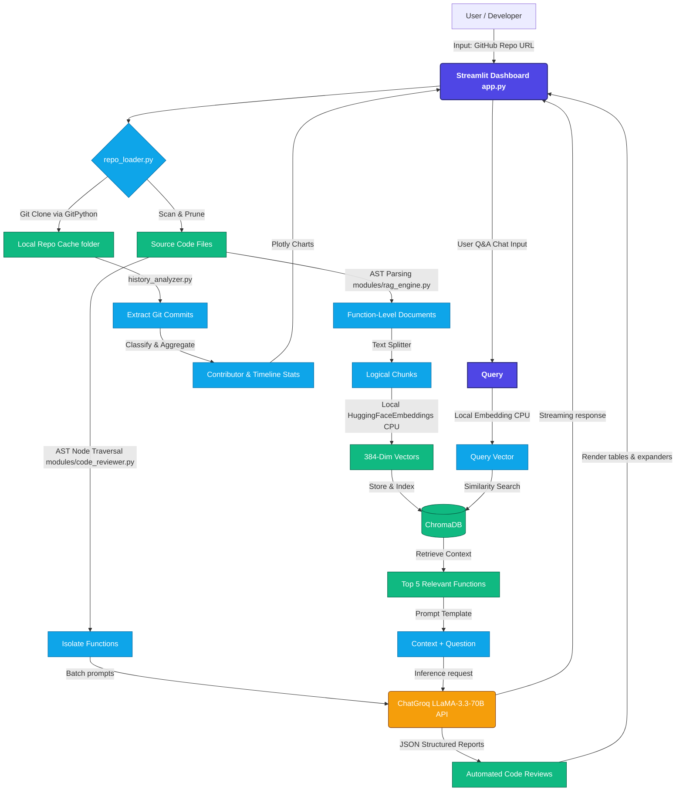

# 🔍 GitHub Repository Analyzer


An AI-powered developer tool that analyzes any GitHub repository using local RAG (Retrieval-Augmented Generation), Git history analytics, and LLM-based code review — all inside an interactive Streamlit dashboard.

---

## 🏗️ System Architecture

Below is the visual architectural diagram of the Git Analyzer pipeline, highlighting the ingestion, AST parsing, RAG semantic indexing, and parallel analysis flows:



---


## 🚀 Key Features

### 💬 Chat with Codebase (Local RAG)
- Ask natural language questions about any part of the codebase.
- Function-level chunking using Python AST for high-precision retrieval.
- Responses mention specific file names and functions.
- Powered by local `sentence-transformers` embeddings, ChromaDB, and Groq LLaMA 3.3.

### 📊 Git History Analytics
- Interactive commit activity timeline.
- Contributor breakdowns (commits, insertions, deletions, and file churn).
- Merge conflict commit detection via message pattern analytics.
- File collision risk mapping (tracks high-contributor files).

### 🔎 LLM Code Review
- Automated bug detection per function.
- Code smell identification.
- Security issue flagging.
- Concrete refactoring suggestions with severity scoring (low, medium, high).

---

## 🛡️ Production & Multi-User Safety Features
The codebase is optimized for local run and secure web hosting (such as Streamlit Community Cloud):
1. **Session-Isolated Cache**: Repo cloning directories (`repo_cache_<uuid>`) and vector store databases (`chroma_db_<uuid>`) are dynamically scoped using unique browser session UUIDs to ensure concurrent users never overwrite each other's data.
2. **Local Embeddings**: Embedding computations are processed locally and offline via the CPU (using `langchain-huggingface` and `sentence-transformers/all-MiniLM-L6-v2`), avoiding external API latency, rate limits, and network errors.
3. **Lock Release Handling**: SQLite and Chroma DB client connections are closed explicitly before directory resets to prevent file locking issues (`WinError 32`) on Windows.

---

## 🛠️ Tech Stack

| Component | Technology |
|---|---|
| **LLM** | Groq LLaMA 3.3 70B |
| **Embeddings** | HuggingFace `all-MiniLM-L6-v2` (Local/Offline) |
| **Vector Database** | ChromaDB |
| **Orchestration** | LangChain |
| **Git Analysis** | GitPython |
| **Visualization** | Plotly |
| **UI Framework** | Streamlit |

---

## ⚙️ Local Setup

**1. Clone the repo**
```bash
git clone https://github.com/nvangaveti/git-analyzer.git
cd git-analyzer
```

**2. Create a virtual environment**
```bash
python -m venv venv
venv\Scripts\activate  # Windows
source venv/bin/activate  # Mac/Linux
```

**3. Install dependencies**
```bash
pip install -r requirements.txt
```

**4. Configure Environment Variables**
```bash
cp .env.example .env
# Edit .env and paste your Groq API key:
# GROQ_API_KEY = "gsk_..."
```
*Note: A Hugging Face token is optional, but setting `HF_TOKEN` in the environment increases your Hugging Face Hub download rate limits.*

**5. Start the Application**
```bash
streamlit run app.py
```

---

## 📁 Project Structure

```
├── app.py                  # Main Streamlit dashboard application
├── modules/
│   ├── __init__.py
│   ├── repo_loader.py      # Git cloning and codebase parsing modules
│   ├── history_analyzer.py # Commit classification and collision analytics
│   ├── rag_engine.py       # Local chunking, RAG chain, and Chroma DB orchestrator
│   └── code_reviewer.py    # AST function extractor and LLM code reviewer
├── requirements.txt        # Package dependencies list
└── .gitignore              # Git ignore rules (ignores caches, env files, and venv)
```

---

## 🌐 Deployment: Hugging Face Spaces (Docker SDK)

This app is deployed on Hugging Face Spaces as a custom Docker container.

### Deployed Application Links
- **Interactive Live App**: [Standalone App](https://nikhilv1104-git-analyzer.hf.space)
- **Hugging Face Space Repository**: [nikhilv1104/git-analyzer](https://huggingface.co/spaces/nikhilv1104/git-analyzer)

### How to Deploy Your Own:
1. Create a new Space on [Hugging Face](https://huggingface.co/).
2. Select **Docker** as the SDK and choose the **Blank** template.
3. Link your GitHub repository or configure mirroring under Space Settings.
4. Set up the following secrets in Space Settings under **Variables and secrets**:
   * `GROQ_API_KEY`: Your Groq API key.
   * `HF_TOKEN`: Your Hugging Face Access Token.
5. Hugging Face will automatically detect the custom `Dockerfile`, build the container (optimized with CPU-only PyTorch), and launch your live application!
